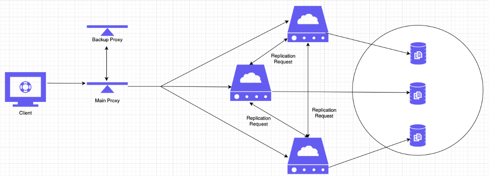
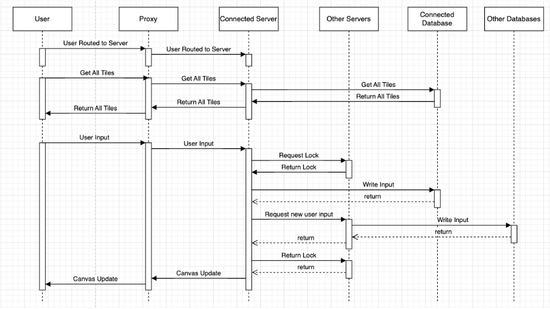

# r/Piazza
CPSC559 Project

## architecture



## user interface


## sequence diagram



## video

<video width="320" height="240" controls>
  <source src="./Images/ProjectRecordingShortened.mp4" type="video/mp4">
  Your browser does not support the video tag.
</video>

## Local Development

If you modify your nginx.conf file, you need to restart nginx for the changes to take effect
start proxy server: 

```
sudo nginx
```

stop proxy server:

```
sudo nginx -s stop
```

```/usr/local/etc/nginx/nginx.conf```

from backend folder
run server 1: 

```
npm run start-server-1
```

run server 2: 

```
npm run start-server-2
```

run server 3: 

```
npm run start-server-3
```

from frontend folder
start frontend: 
```npm run dev```

try npm install if you get errors with npm
```npm install```

bypass proxy in local development:
change .env.development to (point to server1):
```
VITE_SERVER_URL=http://localhost:4000/api
VITE_SOCKET_URL=http://localhost:4000/
```

## Remote Development (AWS)
In order to set up the project in AWS, we set up 5 servers on 3 machines (for now, can expand to 5 different machines).

Each machine is a different EC2 instance.

2 machines are two different proxy servers. They are using NGINX Plus, with High Availabilty. Essentially this delagates one main server
and one backup server for the proxies. If the main server goes down, there is a script in the NGINX server (both of them) that re-associates the
Elastic IP to the other proxy server (EC2 instance resource).

The main machine that handles our backend is another EC2 instance. It runs the same as the local development; each backend server is assigned
a port that the proxies will redirect to. The front end willbe listening to connections at a certain port.

### NGINX Remote Commands
Start server: 
```
sudo systemctl start keepalived
```

Stop server: 
```
sudo systemctl stop keepalived && sudo systemctl stop nginx
```

Check status: 
```
sudo systemctl status keepalived 
```

Troubleshoot:
```
sudo nginx -t
```


### Pre-Requisites
1. Install NGINX on the EC2 isntacnes. We followed this tutorial: https://docs.nginx.com/nginx/deployment-guides/amazon-web-services/high-availability-keepalived/#step-2--allocate-an-elastic-ip-address 
2. Start another EC2 instance to put this project in, we will call this the main EC2 isntance.
3. Install NPM/Node on the main EC2 instance.
4. Transfer the project files into the EC2 instance (can change this to a docker image in the future)
5. Run `nvm install 16` after installing npm.

### Running
1. Log into the main EC2 instance using ssh.
    - make sure that your IP address is added to the security group
2. Whenever you log into an ssh session in the main EC2 instance, you need to run the following command
```
nvm install 16
```
3. Go into the `/backend/` folder and run the server commands from above: 
```npm run start-server-X``` where `X` is the server number
4. Go into the `/frontend/` folder and run the following command. It is slightly different as we need to expose the port to outside connections: ```npm run dev-expose```
5. SSH into both of the NGINX servers. Start/stop/check status accordingly, using the commands under NGINX.
6. Should now be able to connect to http://18.189.193.57:5173/ to run the application.

### Troubleshooting
There are a couple of issues encountered when setting up the project in AWS

1. .pem key error
    -  in order for the ".pem" key file to work. will need to run "chmod 400 NGIN_Key.pem" to change the permissions
2. nginx not changing?
    - to change the nginx config file, you will need to head over to /etc/nginx/ and change either "/etc/nginx/nginx.conf" or "/etc/nginx/conf.d/default.conf"
3. nginx just not working?
    - troubleshoot using: `sudo nginx -t`. It will give you the most likely cause and you can go from there
4. nginx was still not working --> connection refused error
    - this was due to the aws scripts that was needed to switch the elastic ip association when the other ip was down
    - the aws cli commands in the /usr/lib/keepalived/nginx-ha-notify" were not working
    - need to install AWS CLI before running anything
        ```
        sudo apt install awscli
        ```
    - furthermore, there were bugs in the ```nginx-ha-notify``` script that was provided in the NGINX tutorial that was followed. Mainly needed to point to the right python path (```python3``` instead of ```python```) and including the correct python notation for the AWS cli commands.
    - The fix for this issue: running each AWS command in the script on its own, to make sure that the correct variables were being extracted by the script (and in turn, the correct instance ids of the other server were being serverd correctly, allowing for the AWS account to switch the elastic IP.)
5. nginx, aws cli commands are still not working
    - this is most likely a AWS credential issue. Either attatch a correct IAM role to the EC2 instance or have the correct access key and credentials key in the ```nginx-ha-notif``` script file
    - My fix was to generate a new acccess key and update the credentials by running "aws configure"
6. After switching, you will get kicked out of the EC2 instance as a new static ip is being provisioned. SSH issue when trying to ssh back in
    - old key issue in the ssh-keygen
    - need to remove the key stuff
    - ```ssh-keygen -R hostname``` where ```hostname = ec2-123-456-78-910.us-east-2.compute.amazonaws.com``` in this case


